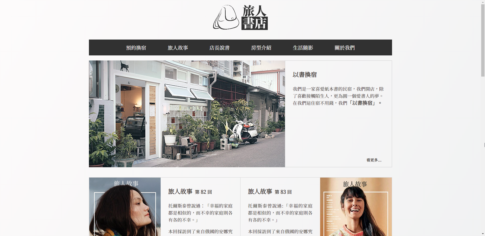
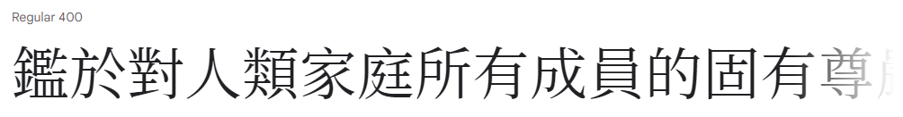
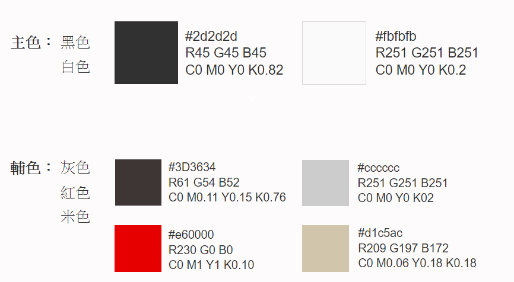
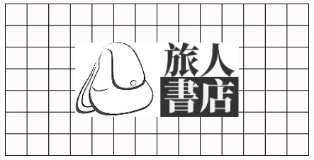

# [旅人書店 - 二手書換宿](https://samchiu064.github.io/stay_bookstore/)
此專案為 2019 年資策會前端班之個人作品，為不使用 css library 開發的 RWD 靜態網站。

關鍵字：No library, SCSS, RWD, jQuery, Static website

  

## 目錄
- [網站介紹](#網站介紹)
- [網站設計](#設計)
  - [字體選用](#字體選用)
  - [色彩計畫](#色彩計畫)
  - [Logo 設計](#Logo-設計)
  - [網站架構](#網站架構)
- [使用技術與工具](#使用技術與工具)
  - [設計相關](#設計相關)
  - [前端開發相關](#前端開發相關)
- [關於作者](#關於作者)
- [License](#License)

---

## 網站介紹

  - 網站名稱：旅人書店 - 二手書換宿
  - 網站主題：結合書店與民宿的複合式書店
  - 架站目的：以說故事的方法吸引客人到實體店住宿
  - 目標客群：喜歡讀書、旅遊的人
  - 網站特色：二手書換宿、採訪旅人寫成故事、線上說書

---

## 網站設計

### 字體選用

[思源宋體](https://fonts.google.com/noto/specimen/Noto+Serif+TC)

字體上採用思源黑體的有襯線字體版本 – 思源宋體，除了考慮到思源家族具備六種可選用字重，也因應書店的主題，選用在印刷上常見的有襯線字體。

### 色彩計畫

### Logo 設計

背包代表旅行和滿載著的故事，黑底和白字給人書籍、報章雜誌的印象，將兩著結合，也象徵著共同經營旅店與書店。方形則傳遞出堅毅、可信的感覺。

### 網站架構

<pre>
  |- 首頁
    |- 預約換宿
    |- 旅人故事 ---> 旅人故事文章
    |- 店長說書
    |- 房型介紹
    |- 生活隨影
    |- 關於我們
</pre>

---

### 使用技術與工具

### 設計相關

  - [Adobe Photoshop](https://www.adobe.com/products/photoshop.html) - 產品圖後製、繪製桌電版 Mockups、繪製行動裝置版 Mockups
  - [Adobe Illustrator](https://www.adobe.com/products/illustrator.html) - 繪製 Logo
  
### 前端開發相關

  - [HTML5](https://www.w3schools.com/html/)
  - [CSS3](https://www.w3schools.com/css/)
  - [JavaScript](https://www.w3schools.com/js/DEFAULT.asp)
  - [SCSS](https://sass-lang.com/)
  - [Github](https://github.com/)

---

## 關於作者

Sam Chiu ([LinkedIn](https://www.linkedin.com/in/sam-chiu-4b7557137/))

本作品僅供個人學習及交流使用。若您對本作品有任何疑問或想法，歡迎來信讓我知道。

  

---

## License

Copyright © 2019 旅人書店. All rights reserved.